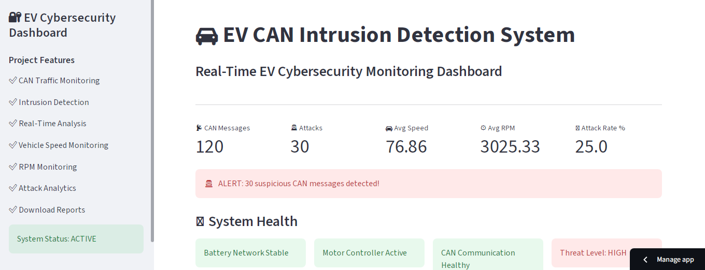
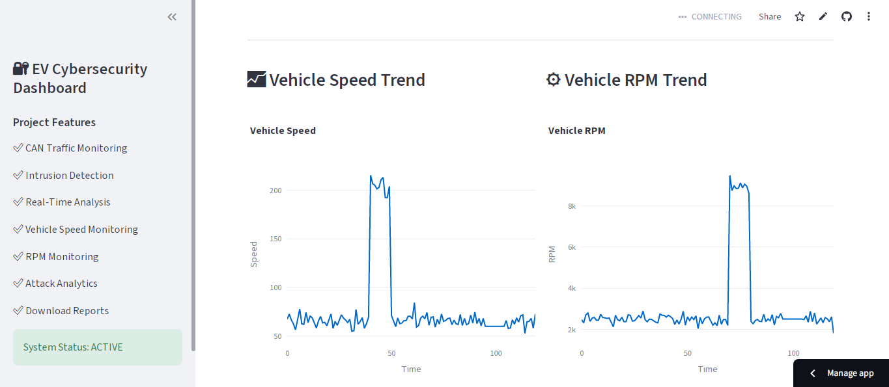
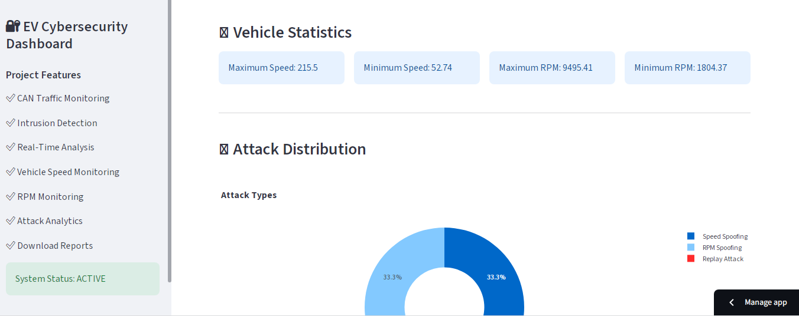
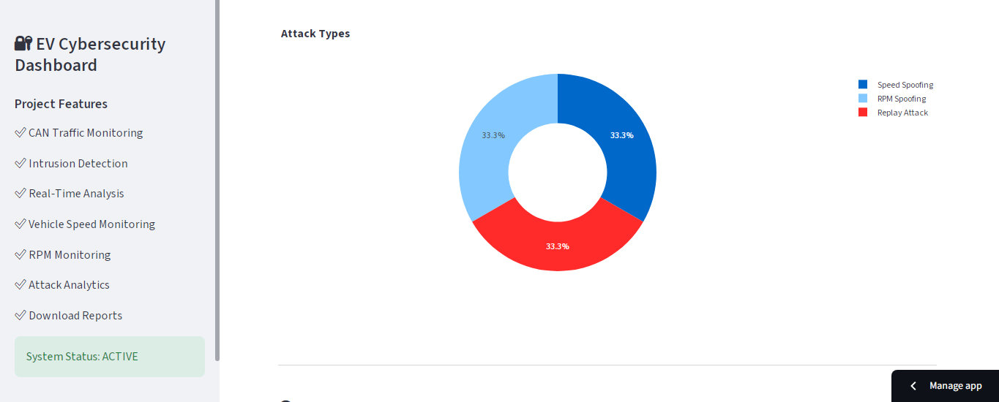
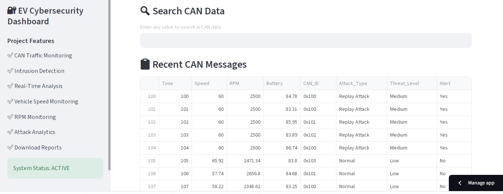
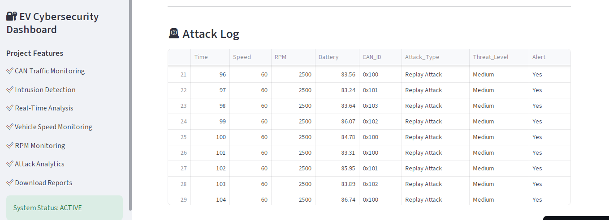
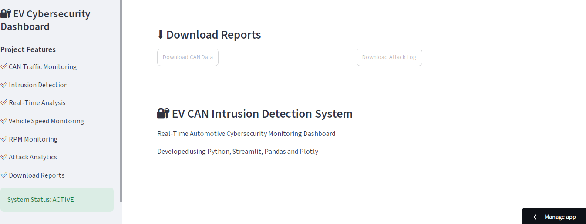

# EV CAN Intrusion Detection System

## Overview

A real-time Electric Vehicle (EV) CAN Bus Cybersecurity Monitoring Dashboard developed using Python, Streamlit, Pandas, and Plotly.

This project monitors CAN network traffic, detects suspicious messages, visualizes vehicle parameters, and provides cybersecurity insights through an interactive dashboard.

---

## Project Objective

The objective of this project is to detect abnormal CAN bus activity in Electric Vehicles and present cybersecurity analytics through a professional real-time monitoring dashboard.

---

## Features

✅ Real-Time CAN Message Monitoring

✅ Intrusion Detection Alerts

✅ Vehicle Speed Analysis

✅ Vehicle RPM Analysis

✅ Attack Distribution Visualization

✅ Interactive Charts and Graphs

✅ CAN Traffic Analytics

✅ Security Monitoring Dashboard

✅ Data Tables for CAN Messages

✅ Attack Log Monitoring

---

## Technologies Used

- Python
- Streamlit
- Pandas
- Plotly
- GitHub
- Streamlit Community Cloud

---

## Dataset

### CAN Data
- Vehicle Speed
- RPM
- CAN Message Information

### Attack Log
- Normal Traffic
- DoS Attack
- Fuzzy Attack
- RPM Spoofing

---

## Dashboard Screenshots

### Dashboard Overview

### Dashboard Analytics

### Speed and RPM Monitoring

### Attack Detection

### Attack Distribution

### CAN Traffic Analysis

### Final Dashboard View

---

## Live Dashboard

Paste your Streamlit dashboard link below:

https://ev-can-intrusion-detection-mlfesgciuvxth8z8fntzkt.streamlit.app/
---

## Repository Structure

EV-CAN-Intrusion-Detection

├── app.py

├── can_data.csv

├── attack_log.csv

├── requirements.txt

├── README.md

├── 1.PNG

├── 2.PNG

├── 3.PNG

├── 4.PNG

├── 5.PNG

├── 6.PNG

└── 7.PNG

---

## Future Improvements

- Machine Learning Based Intrusion Detection
- Real-Time CAN Bus Interface Integration
- Predictive Threat Analysis
- Advanced Cybersecurity Alerts
- Cloud-Based Monitoring

---

## Author

Aishwarya Khare

Electronics and communication Engineering

Project: EV CAN Intrusion Detection System

---
